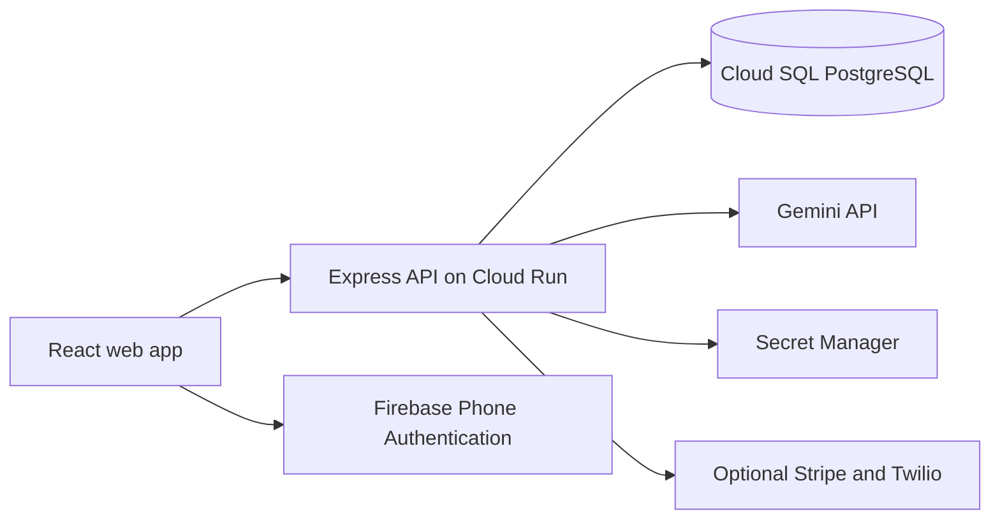

# Common Ground · Café Companion

A mobile-friendly café companion for ordering, seating, service requests, and shared bills. Built with React, Express, Firebase Authentication, Gemini, and PostgreSQL, with deployment support for Google Cloud Run and Cloud SQL.

The café branding, menu, prices, nutrition estimates, and floor plan are fictional. **Live mode stores actual app activity:** table claims, orders, requests, bills, and staff actions. It starts with available tables and no operational fixtures.

## Features

| For guests | For the café team |
| --- | --- |
| Search the menu, filter categories, customize drinks, and reorder | Follow orders from accepted → preparing → ready → served |
| View estimated calories and serving sizes | Pause the kitchen and mark products sold out |
| Explore every menu item in 3D, with AR on compatible devices | Confirm seating, move parties, and manage cleaning |
| Draft an order from text, a food photo, or a voice recording with Gemini | Respond to water, help, and bill requests |
| Request a table, join the waitlist, and follow order progress | Assign available tables from the waitlist |
| Split a bill equally or by custom amounts, with phone-number invitations | Track outstanding balances and record collected counter payments |
| Sign in with Firebase phone OTP for access across devices | Sign in as owner, barista, or floor staff |
| Access configured Wi-Fi details after seating confirmation | Generate printable table QR codes |

Also includes an installable web-app manifest, optional browser WebMCP tools, device-local favorites, and a small coffee-runner game in the footer. See [FEATURES.md](FEATURES.md) for the full walkthrough.

## Quick start

**Requirements:** Node.js 22 recommended (minimum 20.19), npm, and a modern browser.

```sh
git clone https://github.com/SharatChandar/gdg-builder-popup-cafe.git
cd gdg-builder-popup-cafe
npm ci
cp .env.example .env
npm run dev
```

Open [localhost:8080](http://localhost:8080). Staff access is at `/staff`.

The default local environment uses embedded PostgreSQL through PGlite and `DEMO_MODE=true`. The local demo staff PIN is `2468`; demo payments and SMS are simulated. This PIN is **not a production credential**. Local data is stored under the ignored `.data/` directory. Real Gemini and Firebase calls require configuration even in demo mode.

```sh
npm run build   # Build the React client
npm start       # Serve the production client and API locally
```

## Stack and layout



```text
src/                   React UI, 3D/AR models, WebMCP, and styles
server/                Express routes, auth, pricing, AI, and persistence
public/                Manifest, service worker, and static assets
scripts/               Google bootstrap, deployment, and verification helpers
tests/                 Unit, integration, and Playwright browser tests
.env.example           Configuration template with no credentials
Dockerfile             Multi-stage Cloud Run container build
```

The MVP stores one JSONB state row per café. PostgreSQL transactions and `SELECT ... FOR UPDATE` serialize table claims and bill updates across instances. This is intentionally a small single-café design; a larger rollout should use normalized tables, scoped queries, archival, and distributed rate limiting. Guests poll for changes every five seconds; staff poll every four seconds.

## Configuration

Start from [.env.example](.env.example). Never commit a populated `.env` or put provider secrets in frontend build variables.

| Variables | Purpose |
| --- | --- |
| `PORT`, `PUBLIC_URL`, `CURRENCY` | Server port, canonical origin, and currency (default INR) |
| `DEMO_MODE` | Set `false` for live operation; live mode requires HTTPS and credentials |
| `SESSION_SECRET` | Long random server-side cookie-signing secret, at least 32 characters |
| `STAFF_ACCOUNTS_JSON` | Production staff accounts with usernames, roles, and salted scrypt hashes |
| `STAFF_PIN` | Legacy/local demo sign-in; use individual accounts for deployment |
| `DATA_STORE`, `DATA_PATH`, `CAFE_ID` | Storage mode, local database path, and isolated café identifier |
| `INSTANCE_CONNECTION_NAME`, `DB_USER`, `DB_PASSWORD`, `DB_NAME` | Cloud SQL connection and database credentials |
| `DATABASE_URL`, `DB_SSL` | Optional direct PostgreSQL connection; `DB_SSL=true` verifies TLS certificates |
| `GEMINI_API_KEY`, `GEMINI_MODEL`, `GEMINI_FALLBACK_MODEL` | Server-side AI credentials and model selection |
| `FIREBASE_PROJECT_ID`, `FIREBASE_WEB_API_KEY`, `FIREBASE_AUTH_DOMAIN`, `FIREBASE_APP_ID` | Firebase web configuration and server project |
| `STRIPE_SECRET_KEY`, `STRIPE_WEBHOOK_SECRET` | Optional real online payments |
| `TWILIO_ACCOUNT_SID`, `TWILIO_AUTH_TOKEN`, `TWILIO_FROM` | Optional SMS bill invitations |
| `WIFI_SSID`, `WIFI_PASSWORD` | Café network instructions shown to seated guests |

Firebase web configuration is public by design. Gemini keys, session secrets, database passwords, staff hashes, and payment-provider credentials stay on the server. Firebase Admin uses Application Default Credentials locally and the runtime service account on Cloud Run.

### Gemini, calories, and AR

- Gemini accepts text, JPEG/PNG/WebP food images, and short audio recordings. Uploads are limited to 4 MB; the recorder stops at 20 seconds. Requests run only after **Ask Gemini** is pressed.
- Suggestions are drafts. Server validation checks menu IDs, quantities, and milk options; the user must review and submit an order. The app does not persist uploaded media or identify people in images.
- The default model is `gemini-3.8-flash`. Temporary 429/503 responses retry once with `gemini-3.7-flash`, configurable through `GEMINI_FALLBACK_MODEL`. Provider failures remain visible; live mode never substitutes a mock AI response.
- Calories are **illustrative estimates per original-recipe serving**, not measured nutrition. Milk swaps and other customizations can change them. The nutrition backfill preserves existing values and operational data.
- 3D models are illustrative. Surface placement requires HTTPS and a device/browser supporting WebXR immersive AR and hit testing. Unsupported browsers keep the normal 3D preview. Actual camera placement needs physical-device testing.

### Firebase phone sign-in

Register a Firebase web app, enable Phone Authentication, configure allowed SMS regions and billing, and add the app's hostname to Authorized domains. The browser uses Firebase reCAPTCHA and OTP; the API verifies the token and phone provider before issuing an HTTP-only session. Current anonymous records are linked to that account, while other signed-in accounts remain separate. Favorites stay device-local.

### Staff roles

| Role | Permissions |
| --- | --- |
| Owner | All staff operations and the team overview |
| Barista | Order stages, menu availability, and kitchen pause/resume |
| Floor | Seating, table moves, waitlist assignments, service requests, and counter receipts |

Generate separate credentials with the bootstrap helper's `staff` action. Passwords are saved to the ignored `.data/staff-access.txt`; only salted hashes are stored in the staff secret. The staff API never returns password hashes. A counter receipt requires explicit confirmation that money has been collected and records the staff username.

## Deploy to Google Cloud

Use a billing-enabled project and an authenticated Google Cloud CLI. Cloud Run, Cloud SQL, Gemini, and Firebase SMS may incur charges.

1. Enable Cloud Run, Cloud Build, Artifact Registry, Cloud SQL Admin, Secret Manager, Firebase, Identity Toolkit, API Keys, and Generative Language APIs as needed.
2. Create a PostgreSQL Cloud SQL instance, application database, and database user. The deploy script connects using the Cloud SQL Unix socket.
3. Create `cafe-runtime@YOUR_PROJECT_ID.iam.gserviceaccount.com`. Grant Cloud SQL Client and Firebase Authentication Viewer, plus Secret Manager access to the app's specific secrets.
4. Create `cafe-session-secret`, `cafe-db-password`, and `cafe-staff-accounts`. Add `cafe-gemini-key` if enabling Gemini. Keep their values in Secret Manager.
5. Configure Firebase Phone Authentication and its authorized domain.
6. Run the deployment script with your own values:

```sh
export GOOGLE_CLOUD_PROJECT=YOUR_PROJECT_ID
export REGION=asia-south1
export SERVICE=common-ground-cafe
export INSTANCE_CONNECTION_NAME=YOUR_PROJECT_ID:asia-south1:YOUR_INSTANCE
export DB_USER=cafe
export DB_NAME=cafe
export CAFE_ID=common-ground-live
export PUBLIC_URL=https://YOUR_SERVICE_DOMAIN
export FIREBASE_WEB_API_KEY=YOUR_PUBLIC_FIREBASE_WEB_KEY
export FIREBASE_APP_ID=YOUR_FIREBASE_APP_ID
export GEMINI_SECRET_NAME=cafe-gemini-key
bash scripts/deploy.sh
```

The script deploys `DEMO_MODE=false` with Cloud SQL and Secret Manager bindings, then sets the canonical URL to the returned service URL. Add that final hostname to Firebase's authorized domains. It does not create a project, billing account, or SQL instance. Existing database records are retained; new live cafés start with the fictional menu and layout and empty operational records.

[`scripts/bootstrap_google.py`](scripts/bootstrap_google.py) includes optional `firebase`, `secrets`, `staff`, `database`, `auth-domain`, and `verify-gemini` actions. Review it before use: it provisions resources, and its database helper assumes an existing `common-ground-db` instance. Generated credentials and Firebase configuration go only into `.data/`.

For an **existing, configured** service, publish code while preserving its environment and secret bindings:

```sh
gcloud run deploy YOUR_SERVICE --project YOUR_PROJECT_ID \
  --region YOUR_REGION --source .
```

GitHub Actions runs checks only; pushing to GitHub does not automatically deploy or provision cloud resources.

## Payments, SMS, and scope

Live mode never simulates a successful payment or SMS. Counter receipts work through staff confirmation. Online checkout requires merchant credentials and a Stripe webhook at `/api/webhooks/stripe`; only validated payment events settle online shares. Bill-invitation SMS requires Twilio and explicit recipient confirmation. Firebase login OTP is a separate service.

Bills currently belong to individual orders. Splits support 1–12 participants, equal or custom amounts, and signed 24-hour links. Combined table bills, per-item splits, refunds, expired-link renewal, POS synchronization, and SMS delivery callbacks are not implemented. Currency arithmetic assumes two decimal places. Wait estimates are heuristic; Wi-Fi instructions do not automatically join a network.

## Testing

```sh
npm test                                # Domain, auth, SQL, AI, models, nutrition
npm run build
npx playwright install chromium         # One-time browser setup
npm run test:e2e                         # Build and browser/API tests
node tests/live-server.mjs               # Isolated live-mode integration checks
```

Tests use temporary databases; they do not populate a deployed café. Browser tests run on port 8082, and the live-mode integration check uses 8083. Automated tests do not send real SMS or charge payments. The deployed-site verification scripts require your own deployment URL and private staff credential file; do not run them as generic CI checks.

## Contributing and security

Read [CONTRIBUTING.md](CONTRIBUTING.md) for the development workflow and [SECURITY.md](SECURITY.md) for credential handling and private reporting. Environment files, credentials, local databases, screenshots, dependencies, and build output are excluded from Git and container uploads. `.env.example` contains configuration names and blank credential values only.

## Image credits

Menu photography illustrates the fictional café and comes from Unsplash:

- [Alina Kovalchuk](https://unsplash.com/photos/iJMHMXT5-5E)
- [Demi DeHerrera](https://unsplash.com/photos/L-sm1B4L1Ns)
- [Monaz Nazary](https://unsplash.com/photos/D2SDg1PSYhE)
- [Giorgio Trovato](https://unsplash.com/photos/UnEkzyLSRHM)

## Provider references

[Firebase phone authentication](https://firebase.google.com/docs/auth/web/phone-auth) · [Cloud SQL from Cloud Run](https://docs.cloud.google.com/sql/docs/postgres/connect-run) · [Gemini API](https://ai.google.dev/gemini-api/docs) · [WebMCP specification](https://webmachinelearning.github.io/webmcp/)
